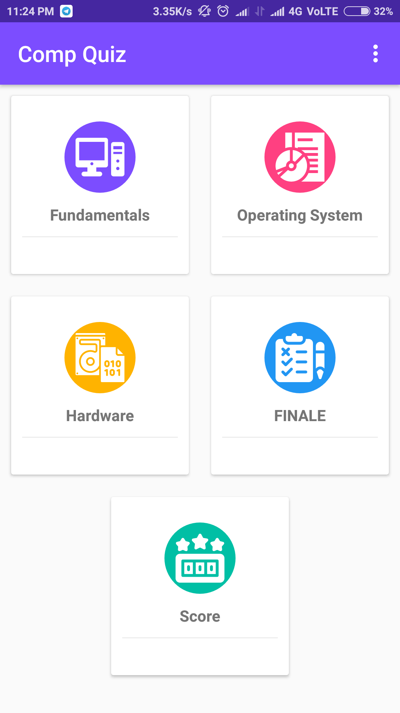

# Comp_Quiz_Android
### Quiz App using Sqlite for quiz questions and Firebase for Leaderboard
------------------------------------------------------------------------------------

- Create your own firebase project and add the google-services.json in the application

- For API KEYS of Firebase <a href="https://firebase.google.com/docs/android/setup#manually_add_firebase">Firebase Docs</a>

  

